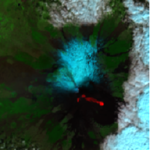

# Rendering Extension Specification

- **Title:** Rendering
- **Identifier:** <https://stac-extensions.github.io/render/v2.0.0/schema.json>
- **Field Name Prefix:** renders
- **Scope:** Item, Collection
- **Extension [Maturity Classification](https://github.com/radiantearth/stac-spec/tree/master/extensions/README.md#extension-maturity):** Pilot
- **Owner**: @emmanuelmathot @abarciauskas-bgse @smohiudd

This document explains the Rendering Extension to the [SpatioTemporal Asset Catalog](https://github.com/radiantearth/stac-spec) (STAC) specification.

Rendering extension aims at providings consumers with the possible rendering of an item or a collection (e.g. on a online map)

- Examples:
  - [Landsat-8 example](examples/item-landsat8.json): Shows the basic usage of the extension in a landsat-8 STAC Item
  - [Sentinel-2 example](examples/item-sentinel2.json): Shows the basic usage of the extension in a Sentinel-2 STAC Item
  - [Vector example](examples/item-vector.json): Shows the extension used on vector data, styled with a MapLibre expression and stylesheet link
  - [Collection example](examples/collection.json): Shows the basic usage of the extension in a collection
- [JSON Schema](json-schema/schema.json)
- [Changelog](./CHANGELOG.md)

## Fields

The fields in the table below can be used in these parts of STAC documents:

- [ ] Catalogs
- [x] Collections
- [x] Item Properties (incl. Summaries in Collections)
- [ ] Assets (for both Collections and Items, incl. Item Asset Definitions in Collections)
- [ ] Links

| Field Name | Type                                         | Description                                                                               |
| ---------- | -------------------------------------------- | ----------------------------------------------------------------------------------------- |
| renders    | Map<string, [Render Object](#render-object)> | **REQUIRED**. Dictionary of rendering objects that can be viewed, each with a unique key. |

### Render Object

| Field Name    | Type      | Description                                                                                                                                                              |
| ------------- | --------- | ------------------------------------------------------------------------------------------------------------------------------------------------------------------------ |
| assets        | \[string] | **REQUIRED**. Array of asset keys [referencing the assets](#assets-reference) that are used to make the rendering                                                        |
| title         | string    | Optional title of the rendering                                                                                                                                          |
| rescale       | \[float]  | 2 dimensions array of delimited Min,Max range per band. If not provided, the data will not be rescaled.                                                                  |
| nodata        | float, string     | Nodata value to use for the referenced assets.                                                                                                                           |
| colormap_name | string    | Color map identifier that must be applied for a raster band                                                                                                              |
| colormap      | object    | [Color map JSON definition](https://developmentseed.org/titiler/advanced/rendering/#custom-colormaps) that must be applied for a raster band                             |
| color_formula | string    | [Color formula](https://developmentseed.org/titiler/advanced/rendering/#color-formula) that must be applied for a raster band                                            |
| resampling    | string    | Resampling algorithm to apply to the referenced assets. See [GDAL resampling algorithm](https://gdal.org/programs/gdalwarp.html#cmdoption-gdalwarp-r) for some examples. |
| expression    | string, object, array | Expression to derive the rendered value(s) from the referenced assets, e.g. a band-math formula or a style expression (which may also cover conditionals, interpolation, or other non-arithmetic operations). See [Expression and stylesheet formats](#expression-and-stylesheet-formats) for how to identify its dialect with `expression_type`. |
| expression_type | string  | Media type identifying the dialect of `expression` (e.g. `text/x-numexpr`, `application/vnd.maplibre.expression+json`). See [Expression and stylesheet formats](#expression-and-stylesheet-formats). If not set, a string `expression` SHOULD be assumed to be `text/x-numexpr` for backwards compatibility; an object or array `expression` SHOULD NOT be assumed to be any particular dialect. |
| minmax_zoom   | \[int]    | Zoom levels range applicable for the visualization                                                                                                                       |

The `render` object is open ended, so additional fields can be provided according to the needs of the rendering application.

## Assets reference

The `assets` field is a list of asset keys referencing the assets that are used to make the rendering.
The assets MUST be local assets defined in the same item.

> \[!NOTE]
> When it is intended to use assets from external items or specific bands in an asset,
> it is recommended to define a [virtual asset](https://github.com/stac-extensions/virtual-assets)
> and then reference its key in the `assets` field. See the [NDVI example](#normalized-difference-vegetation-index-ndvi-example).

## Positioning

The positioning of the source assets is defined by their position in the `assets` array.
Typically, in the case of the composition of a RGB image, the first pointer would be the red band,
the second the green band and the third the blue band.

```json
"assets": [ "red", "green", "blue" ]
```

## Rescaling

A rescaling of the values from the source asset(s) to the destination asset can be defined using the `vrt:rescale` field.
It is specified as a 2 dimensions array of delimited Min,Max range per band.

```json
"rescale": [
  [0, 10000], // band 1
  [0, 10000], // band 2
  [0, 10000]  // band 3
]
```

A prescaling can also be performed according to the `offset` and `scale` fields value of the
[raster](https://github.com/stac-extensions/raster) extension.

## Expression and stylesheet formats

The `render` object is intentionally implementation-agnostic: `expression` and, via
[stylesheet links](#stylesheet-links), a whole external stylesheet, can each be written in more than one
dialect (band-math strings, JSON style-expression arrays, XML style documents, ...). Without saying which
dialect a given value uses, a client has no reliable way to parse it. For example, all of the following are
different, mutually incompatible ways to express the same NDVI formula:

- `numexpr` (used by [TiTiler](https://github.com/developmentseed/titiler)/rio-tiler): a Python-like string,
  e.g. `"(B08-B04)/(B08+B04)"`.
- [MapLibre GL / Mapbox GL style expressions](https://maplibre.org/maplibre-style-spec/expressions/): a JSON
  array, e.g. `["/", ["-", ["band", 2], ["band", 1]], ["+", ["band", 2], ["band", 1]]]`.
- [OpenLayers style expressions](https://openlayers.org/en/latest/apidoc/module-ol_expr_expression.html): also
  JSON-array-based, but a **distinct grammar** from MapLibre/Mapbox's, despite the superficial similarity
  (OpenLayers bridges to actual Mapbox/MapLibre style documents only via the separate
  [`ol-mapbox-style`](https://github.com/openlayers/ol-mapbox-style) adapter package, not natively).

None of these dialects has a formally IANA-registered media type. Where possible this extension reuses the
same informal `vnd.` media types already used by [OGC API - Styles](https://docs.ogc.org/DRAFTS/20-009.html)
for whole stylesheet documents; for expression fragments and dialects OGC API - Styles doesn't cover, this
extension defines its own, following the same `vnd.`/`x-` conventions:

| Format | Media type | Scope |
| --- | --- | --- |
| `numexpr` band math | `text/x-numexpr` | `expression` fragment (string) |
| MapLibre/Mapbox GL style expression | `application/vnd.maplibre.expression+json` | `expression` fragment (array) |
| OpenLayers style expression | `application/vnd.openlayers.expression+json` | `expression` fragment (array) |
| Mapbox/MapLibre Style (full stylesheet) | `application/vnd.mapbox.style+json` | stylesheet document (reused from OGC API - Styles) |
| OGC Styled Layer Descriptor (SLD) | `application/vnd.ogc.sld+xml` | stylesheet document (reused from OGC API - Styles) |
| OpenLayers Flatstyle (full stylesheet) | `application/vnd.openlayers.flatstyle+json` | stylesheet document |
| QGIS QML style | `application/vnd.qgis.qml+xml` | stylesheet document |

`expression_type` uses the "expression fragment" rows to disambiguate the `expression` field. A
[stylesheet link](#stylesheet-links)'s `type` uses the "stylesheet document" rows, since it points at a
whole, standalone style document rather than a single formula. This table is not exhaustive: additional
formats can be added following the same convention as new renderers need to be supported.

## Renderer integration

The render objects are designed to be used by dynamic tile servers and by client-side rendering libraries to
produce a visualization from a STAC Item. They are generic enough to be used by any renderer. In the following
sections, some renderer integrations are described.

### Titiler

[titiler](https://github.com/developmentseed/titiler) offers a native
[STAC reader](https://github.com/developmentseed/titiler/blob/main/docs/src/endpoints/stac.md).

The following table describes the titiler query parameters that could be used and the corresponding extension fields.

Either the client building titiler url can use the information in the virtual asset to build the query parameters
or the dynamic tile server could use the information in the virtual asset to build the query parameters
by simply specifying the `url` and `assets` query parameters.

| Query key       | field                                  | Description                                                                                                                         |
| --------------- | -------------------------------------- | ----------------------------------------------------------------------------------------------------------------------------------- |
| `url`           | `href` in item self link               | STAC Item URL                                                                                                                       |
| `assets`        | `assets`                               | Assets keys to use for the tile rendering defined in the `assets` field                                                             |
| `rescale`       | `rescale`                              | Delimited Min,Max bounds defined in `rescale` field.                                                                                |
| `expression`    | `expression`                           | Band arithmetic formula as defined in field `expression`                                                                            |
| `nodata`        | `nodata` or `nodata` `raster:bands`    | If not provided in `nodata` field, the nodata value can be read from the `nodata` field of the corresponding `raster:bands` object. |
| `unscale`       | `scale` and `offset` in `raster:bands` | Scale and Offset value defined in `scale` and `offset` fields of the corresponding `raster:bands` item                              |
| `colormap_name` | `colormap_name`                        | Color map name defined in `colormap` field of the `asset`                                                                           |
| `colormap`      | `colormap`                             | Color map JSON definition as defined in `colormap` object of the `asset` (overrides `colormap_name` if present )                    |
| `color_formula` | `color_formula`                        | Color formula as defined in `color_formula` field of the `asset`                                                                    |
| `resampling`    | `resampling`                           | Resampling method to use when reprojecting the raster.                                                                              |
| `bidx`    | `bidx`                           | Dataset band indexes                                                                            |

#### Shortwave Infra-red visual thermal signature example

From the [Sentinel-2 item](https://github.com/stac-extensions/virtual-assets/blob/main/examples/item-sentinel2.json):

```json
"properties":{
  "renders":{
    "sir":
    {
      "title": "Shortwave Infra-red",
      "assets": [ "swir22", "nir",  "red" ],
      "rescale": [[0,5000],[0,7000],[0,9000]],
      "resampling": "nearest"
    }
  }
}
```

| Query key | value                                               | Example value                                                                                |
| --------- | --------------------------------------------------- | -------------------------------------------------------------------------------------------- |
| url       | STAC Item URL                                       | `https://raw.githubusercontent.com/stac-extensions/raster/main/examples/item-sentinel2.json` |
| assets    | Assets keys defined in the `assets` fields          | `B12,B8A,B04`                                                                                |
| rescale   | Delimited Min,Max bounds defined in `rescale` field | `0,5000,0,7000,0,9000`                                                                       |

URL: [`https://api.cogeo.xyz/stac/crop/14.869,37.682,15.113,37.862/256x256.png?url=https://raw.githubusercontent.com/stac-extensions/raster/main/examples/item-sentinel2.json&assets=B12,B8A,B04&resampling_method=average&rescale=0,5000,0,7000,0,9000&return_mask=true`](https://api.cogeo.xyz/stac/crop/14.869,37.682,15.113,37.862/256x256.png?url=https://raw.githubusercontent.com/stac-extensions/raster/main/examples/item-sentinel2.json&assets=B12,B8A,B04&resampling_method=average&rescale=0,5000,0,7000,0,9000&return_mask=true)

**Result**: Lava thermal signature of Mount Etna eruption (February 2021)



#### Normalized Difference Vegetation Index (NDVI) example

From the [Landsat-8 example](examples/item-landsat8.json) \[[article](https://www.usgs.gov/core-science-systems/nli/landsat/landsat-normalized-difference-vegetation-index?qt-science_support_page_related_con=0#qt-science_support_page_related_con)]:
This example uses the [virtual assets](https://github.com/stac-extensions/virtual-assets) to define the NDVI asset first because in this use case,
the NDVI asset could also be downloaded as a standalone asset.

```json
"assets":{
  "ndvi": 
  {
    "roles": [ "virtual", "data", "index" ],
    "type": "image/vnd.stac.geotiff; cloud-optimized=true",
    "href": "https://raw.githubusercontent.com/stac-extensions/render/main/examples/item-landsat8.json#/assets/ndvi",
    "vrt:hrefs": [
      { "key": "B04", "href": "https://raw.githubusercontent.com/stac-extensions/render/main/examples/item-landsat8.json#/assets/B04"}, 
      { "key": "B05", "href": "https://raw.githubusercontent.com/stac-extensions/render/main/examples/item-landsat8.json#/assets/B05"}],
    "title": "Normalized Difference Vegetation Index",
    "vrt:algorithm": "band_arithmetic",
    "vrt:algorithm_opts": {
      "expression": "(B05–B04)/(B05+B04)",
      "rescale": [[-1,1]]
    },
  }
},
"properties":{
  "renders":{
    "ndvi":
    {
      "title": "Normalized Difference Vegetation Index",
      "assets": [ "ndvi" ],
      "resampling": "average",
      "colormap_name": "ylgn"
    }
  }
}

```

If this case, the parameters to titiler must be extracted from both the virtual asset definition and the render object.

| Query key         | value                                                                            | Example value                                                                               |
| ----------------- | -------------------------------------------------------------------------------- | ------------------------------------------------------------------------------------------- |
| url               | STAC Item URL                                                                    | `https://raw.githubusercontent.com/stac-extensions/raster/main/examples/item-landsat8.json` |
| expression        | Band math formula as defined in field `vrt:algorithm`                            | `(B5–B4)/(B5+B4)`                                                                           |
| rescale           | Delimited Min,Max bounds defined in `rescale` field                              | `-1,1`                                                                                      |
| colormap          | Color map JSON definition as defined in `colormap_name`                          | `ylgn`                                                                                      |
| resampling_method | Resampling method to use when reprojecting the raster as defined in `resampling` | `average`                                                                                   |

URL:

[`https://api.cogeo.xyz/stac/preview.png?url=https://raw.githubusercontent.com/stac-extensions/raster/main/examples/item-landsat8.json&expression=(B5–B4)/(B5+B4)&max_size=512&width=512&resampling_method=average&rescale=-1,1&color_map=ylgn&return_mask=true`](https://api.cogeo.xyz/stac/preview.png?url=https://raw.githubusercontent.com/stac-extensions/raster/main/examples/item-landsat8.json&expression=(B5–B4)/(B5+B4)&max_size=512&width=512&resampling_method=average&rescale=-1,1&color_map=ylgn&return_mask=true)

Result:  Landsat Surface Reflectance Normalized Difference Vegetation Index (NDVI) path 44 row 33.

/(B5+B4)&max_size=512&width=512&resampling_method=average&rescale=-1,1&color_map=ylgn&return_mask=true)

Obviously, the same rendering can be applied to local source assets without using the virtual asset.

```json
"properties":{
  "renders":{
    "ndvi":
    {
      "title": "Normalized Difference Vegetation Index",
      "assets": [ "B05", "B04" ],
      "resampling": "average",
      "colormap_name": "ylgn",
      "expression": "(B05–B04)/(B05+B04)",
      "expression_type": "text/x-numexpr",
      "rescale": [[-1,1]]
    }
  }
}
```

### OpenLayers

[OpenLayers](https://openlayers.org/) can render both the raster and vector cases covered by this extension,
but through different APIs. Unlike TiTiler, OpenLayers renders directly in the browser: there is no tile
server, so a client maps `render` fields onto OpenLayers constructs itself.

#### Raster: `ol/source/GeoTIFF` and `ol/layer/WebGLTile`

A [`GeoTIFF`](https://openlayers.org/en/latest/apidoc/module-ol_source_GeoTIFF-GeoTIFFSource.html) source reads
one or more (Cloud Optimized) GeoTIFFs, and a
[`WebGLTileLayer`](https://openlayers.org/en/latest/apidoc/module-ol_layer_WebGLTile-WebGLTileLayer.html)
renders it using a `style` expression (from [`ol/expr/expression`](https://openlayers.org/en/latest/apidoc/module-ol_expr_expression.html)).

| OL construct | field | Description |
| --- | --- | --- |
| One `sources` entry per asset href | `assets` | Order determines the `['band', N]` index (1-based) referencing that asset |
| `['interpolate', ['linear'], ['band', N], min, 0, max, 1]`, composed per band with `['array', ...]` | `rescale` | Per-band Min,Max bounds |
| `['palette', index, colors]` (discrete) or `['interpolate', ...]` color stops (continuous) | `colormap_name` / `colormap` | OpenLayers ships no named palettes; color stops/values must be supplied explicitly |
| `sources[].nodata` | `nodata` | Nodata value for that source |
| a numeric `ol/expr/expression` assigned to `style.color`, using the same operators as above | `expression` (when `expression_type` is `application/vnd.openlayers.expression+json`) | See [ol/expr/expression](https://openlayers.org/en/latest/apidoc/module-ol_expr_expression.html) for the full operator list, including arithmetic |
| — | `resampling` | Not exposed by `ol/source/GeoTIFF`; resampling is handled internally by the WebGL renderer |

Example, rendering the [Shortwave Infra-red example](#shortwave-infra-red-visual-thermal-signature-example)'s
`sir` render (`assets: ["B12", "B08", "B04"]`, `rescale: [[0,5000],[0,7000],[0,9000]]`):

```js
import GeoTIFF from 'ol/source/GeoTIFF.js';
import TileLayer from 'ol/layer/WebGLTile.js';

const source = new GeoTIFF({
  sources: [
    { url: 'https://sentinel-cogs.s3.us-west-2.amazonaws.com/sentinel-s2-l2a-cogs/33/S/VB/2021/2/S2B_33SVB_20210221_0_L2A/B12.tif' }, // band 1
    { url: 'https://sentinel-cogs.s3.us-west-2.amazonaws.com/sentinel-s2-l2a-cogs/33/S/VB/2021/2/S2B_33SVB_20210221_0_L2A/B08.tif' }, // band 2
    { url: 'https://sentinel-cogs.s3.us-west-2.amazonaws.com/sentinel-s2-l2a-cogs/33/S/VB/2021/2/S2B_33SVB_20210221_0_L2A/B04.tif' }, // band 3
  ],
});

const layer = new TileLayer({
  source,
  style: {
    color: [
      'array',
      ['interpolate', ['linear'], ['band', 1], 0, 0, 5000, 1],
      ['interpolate', ['linear'], ['band', 2], 0, 0, 7000, 1],
      ['interpolate', ['linear'], ['band', 3], 0, 0, 9000, 1],
      1,
    ],
  },
});
```

#### Vector: `ol/style/flat` and `ol-mapbox-style`

For vector data (see the [vector example](examples/item-vector.json)), how `expression` is applied depends on
`expression_type`:

| OL construct | field | Description |
| --- | --- | --- |
| A [flat style](https://openlayers.org/en/latest/apidoc/module-ol_style_flat.html) property (e.g. `stroke-color`, `fill-color`) set directly to the expression | `expression` when `expression_type` is `application/vnd.openlayers.expression+json` | OpenLayers' native expression dialect can be used as-is |
| [`stylefunction(olLayer, glStyle, sourceOrLayers)`](https://github.com/openlayers/ol-mapbox-style) from the separate `ol-mapbox-style` package | `expression` when `expression_type` is `application/vnd.maplibre.expression+json`, or a [stylesheet link](#stylesheet-links) with `type: application/vnd.mapbox.style+json` | OpenLayers does not natively understand MapLibre/Mapbox style expressions; `ol-mapbox-style` bridges them onto an existing OL layer |

Native OpenLayers expression (the [vector example](examples/item-vector.json)'s `roads-by-class` render, once
translated to `application/vnd.openlayers.expression+json`):

```js
import VectorTileLayer from 'ol/layer/VectorTile.js';
import VectorTileSource from 'ol/source/VectorTile.js';

const layer = new VectorTileLayer({
  source: new VectorTileSource({ url: 'https://example.com/data/roads/{z}/{x}/{y}.pbf' }),
  style: {
    'stroke-color': [
      'match', ['get', 'class'],
      'motorway', '#e15c5c',
      'primary', '#f2b46d',
      '#cccccc',
    ],
    'stroke-width': 2,
  },
});
```

Applying an actual MapLibre/Mapbox style document, e.g. from a [stylesheet link](#stylesheet-links) with
`type: application/vnd.mapbox.style+json`, to an existing OL layer:

```js
import { stylefunction } from 'ol-mapbox-style';
import VectorTileLayer from 'ol/layer/VectorTile.js';

const layer = new VectorTileLayer({ /* source config */ });

fetch('https://example.com/styles/roads.json')
  .then((response) => response.json())
  .then((glStyle) => stylefunction(layer, glStyle, 'roads'));
```

## Links

It is highly suggested to have a web map link in the `links` section of the STAC Item as described in the
[Web Map Link extension](https://github.com/stac-extensions/web-map-links) to allow application to
find the tiling endpoint of the dynamic tile server.

### Additional Attributes

A [web map link](https://github.com/stac-extensions/web-map-links) can be extended with the attribute `render`
with a value corresponding to the key of the render object in the `renders` field
in order to provide a cross link to the render object.

```json
{
  "rel": "xyz",
  "type": "image/png",
  "title": "NDVI",
  "href": "https://api.cogeo.xyz/stac/preview.png?url=https://raw.githubusercontent.com/stac-extensions/raster/main/examples/item-landsat8.json&expression=(B5–B4)/(B5+B4)&max_size=512&width=512&resampling_method=average&rescale=-1,1&color_map=ylgn&return_mask=true",
  "render": "ndvi"
}
```

### Stylesheet links

To reference an external, standalone style document (as opposed to the inline `expression` field), add a
link with `rel: "stylesheet"` to the item, collection, or (as any STAC Link object) asset. The link MUST
carry a `type` identifying the stylesheet's format, using the "stylesheet document" media types from
[Expression and stylesheet formats](#expression-and-stylesheet-formats) (e.g. SLD, Mapbox/MapLibre Style,
OpenLayers Flatstyle, QGIS QML). Like the web map link's `render` attribute, a stylesheet link MAY set
`render` to cross-reference which `renders` entry it styles.

```json
{
  "rel": "stylesheet",
  "type": "application/vnd.mapbox.style+json",
  "href": "https://example.com/styles/ndvi.json",
  "render": "ndvi"
}
```

#### Addressing a layer within a stylesheet

A single stylesheet document can define more than one named layer or style. When that is the case, `render`
alone is not enough to disambiguate, because it names which `renders` entry the link is for, not which part
of the document to use. Append the layer/style's own name, as defined by that stylesheet format, as a URI
fragment on `href`. This reuses each format's native naming instead of inventing a new addressing scheme:

- SLD: the `<NamedLayer>`/`<UserStyle>` element's `<Name>` text, e.g. `styles.sld#ndvi`.
- Mapbox/MapLibre Style: a top-level `layers[].id`, e.g. `style.json#ndvi-layer`.

```json
"links": [
  {
    "rel": "stylesheet",
    "type": "application/vnd.ogc.sld+xml",
    "href": "https://example.com/styles/multi.sld#ndvi",
    "render": "ndvi"
  },
  {
    "rel": "stylesheet",
    "type": "application/vnd.ogc.sld+xml",
    "href": "https://example.com/styles/multi.sld#sir",
    "render": "sir"
  }
]
```

## Contributing

All contributions are subject to the
[STAC Specification Code of Conduct](https://github.com/radiantearth/stac-spec/blob/master/CODE_OF_CONDUCT.md).
For contributions, please follow the
[STAC specification contributing guide](https://github.com/radiantearth/stac-spec/blob/master/CONTRIBUTING.md) Instructions
for running tests are copied here for convenience.

### Running tests

The same checks that run as checks on PR's are part of the repository and can be run locally to verify that changes are valid. 
To run tests locally, you'll need `npm`, which is a standard part of any [node.js installation](https://nodejs.org/en/download/).

First you'll need to install everything with npm once. Just navigate to the root of this repository and on 
your command line run:
```bash
npm install
```

Then to check markdown formatting and test the examples against the JSON schema, you can run:
```bash
npm test
```

This will spit out the same texts that you see online, and you can then go and fix your markdown or examples.

If the tests reveal formatting problems with the examples, you can fix them with:
```bash
npm run format-examples
```
